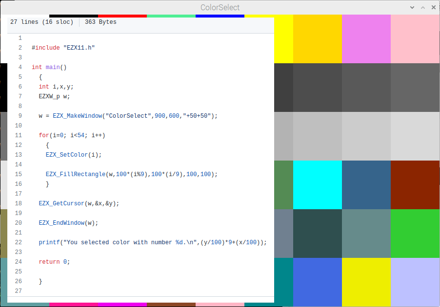

# EZX11

EZX11 — eazy X11 libarry (created by Goang-Tay Hsu (gth), modified by Long-Ji Lin (ljl) at Aug 1, 1990), has unclear source code status.  
So I took original EZX11.h only, and implemented used by demos EZX functions by mapping to [ezxdisp](ezxdisp) submodule library.

# CT
[CT.C](CT.c) Colorselect demo already works, needed a single parameter list change only:  

